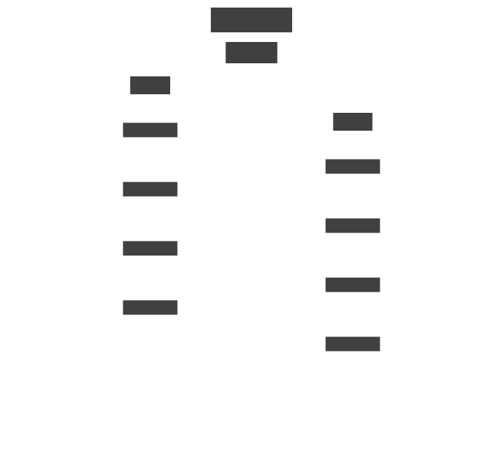

# ADF4030 Clock-Distribution Architectures

The ADF4030 (Aion) is a 10-channel SYSREF synchronizer used to distribute
phase-aligned clocks to large numbers of Apollo data converters. Once a
system exceeds the channel count of a single Aion, the Aions must be
chained together; the chain topology determines how SYSREF propagates,
how skew accumulates, and how many Unit Boards the system needs.

The `Adf4030Architecture` class in `adijif.plls.utils.adf4030_arch`
wraps the partition math (how many Aions per FPGA, how many Apollos per
Aion, how many Unit Boards in the system) with a single object that can
compute the partition, print a summary, and render the per-Unit-Board
topology as an SVG diagram.

## Architectures at a glance

The class supports four topologies, summarised below:

```{mermaid}
flowchart LR
    subgraph cascade["cascade"]
        FC[FPGA] --> AC0[Aion_0] --> AC1[Aion_1] --> AC2[Aion_2]
    end
    subgraph tree["tree"]
        FT[FPGA] --> AT0[Aion_0]
        AT0 --> AT1[Aion_1]
        AT0 --> AT2[Aion_2]
    end
    subgraph hybrid["hybrid (cascade-of-trees)"]
        FH[FPGA] --> AH0[Aion_0] --> AH1[Aion_1]
        AH0 --> AH2[Aion_2]
        AH2 --> AH3[Aion_3]
    end
    subgraph hybrid2["hybrid2 (tree-of-cascades)"]
        FH2[FPGA] --> AH20[Aion_0]
        AH20 --> AH21[Aion_1] --> AH22[Aion_2]
        AH20 --> AH23[Aion_3] --> AH24[Aion_4]
    end
```

| Architecture | Outer topology | Inner topology | Requires `N_branch` |
|---|---|---|---|
| `cascade` | linear chain | (n/a) | no |
| `tree` | star from root Aion | (n/a) | yes |
| `hybrid` | linear chain between branch roots | linear cascade inside each branch | yes |
| `hybrid2` | star from root Aion | linear cascade inside each branch | yes |

## Using `Adf4030Architecture`

```python
from adijif.plls.utils.adf4030_arch import Adf4030Architecture

arch = Adf4030Architecture(
    N=16,           # total Apollo devices in the system
    N_Apollo=8,     # Apollos per Unit Board
    N_FPGA=1,       # FPGAs per Unit Board
    architecture="cascade",
)

print(arch.summary)
# Architecture: cascade
# N (total Apollo devices): 16
# N_Apollo (per Unit Board): 8
# ...

partition = arch.partition           # dict
arch.draw(scope="ub", path="ub.svg") # writes the Unit-Board SVG
```

The constructor validates that `N_branch` is supplied for `tree`,
`hybrid`, and `hybrid2`, and rejects it for `cascade`. Pass
`scope="system"` to render the full multi-Unit-Board diagram; the
returned SVG can also be obtained as a string (the `path` argument
is optional).

## Per-architecture sample diagrams

The diagrams below are generated by `scripts/generate_arch_sample_svgs.py`
with `N=16, N_Apollo=8, N_FPGA=1, N_branch=2`. Re-run that script if
you change the topology helpers.

### Cascade

Each Aion drives the next downstream; SYSREF propagates linearly.

```python
arch = Adf4030Architecture(
    N=16, N_Apollo=8, N_FPGA=1, architecture="cascade"
)
arch.draw(scope="ub", path="adf4030_cascade_ub.svg")
```



### Tree

One root Aion fans out to `N_branch` branches; remaining Aions hang
off the branch heads.

```python
arch = Adf4030Architecture(
    N=16, N_Apollo=8, N_FPGA=1,
    architecture="tree", N_branch=2,
)
arch.draw(scope="ub", path="adf4030_tree_ub.svg")
```


### Hybrid (cascade-of-trees)

Outer linear chain between branch roots; inside each branch, a
linear cascade from the branch root.

```python
arch = Adf4030Architecture(
    N=16, N_Apollo=8, N_FPGA=1,
    architecture="hybrid", N_branch=2,
)
arch.draw(scope="ub", path="adf4030_hybrid_ub.svg")
```


### Hybrid2 (tree-of-cascades)

Root Aion fans out to `N_branch` branch heads; each branch is a
linear cascade.

```python
arch = Adf4030Architecture(
    N=16, N_Apollo=8, N_FPGA=1,
    architecture="hybrid2", N_branch=2,
)
arch.draw(scope="ub", path="adf4030_hybrid2_ub.svg")
```


## Unit-Board scope vs system scope

`scope="ub"` renders a single Unit Board: FPGAs on top, Aions below,
Apollos at the leaves. It is the natural unit of the partition math
and renders quickly for any size of system.

`scope="system"` renders the whole multi-Unit-Board layout: one Unit
Board subtree per `N_UB`, with inter-UB connections between
`FPGA_0`s. The render time grows linearly with `N_UB`, so prefer it
for systems with a handful of Unit Boards. Use the Explorer page
(see [Tools](../tools.md#adf4030-system-designer)) to render
system-scope diagrams interactively at small `N`.

```python
arch = Adf4030Architecture(N=24, N_Apollo=8, N_FPGA=1, architecture="cascade")
arch.draw(scope="system", path="sys.svg")
```

## See also

- [Architecture Tools Reference](../devs/architecture_tools.md) — full API for `Adf4030Architecture` and the supporting free functions.
- [JIF Tools Explorer — ADF4030 System Designer](../tools.md#adf4030-system-designer) — interactive UI for the same partition tooling.
- [External SYSREF Usage](external_sysref.md) — how an ADF4030 plugs into a JIF system as a SYSREF source.
