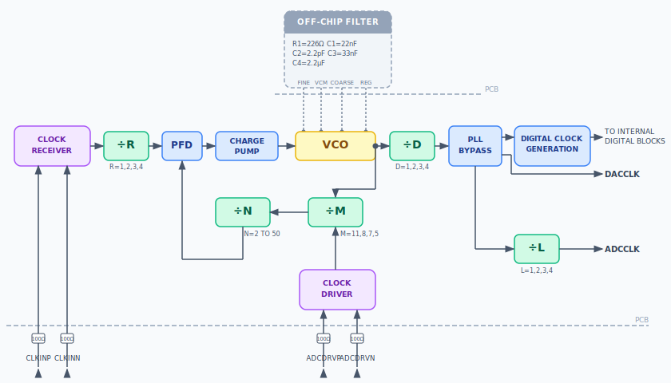

# Data converters

Four types of data converters are supported: ADCs, DACs, transceivers, and ADC/DAC combinations. However, fundamentally from a clocking perspective, it does not matter if a component is a DAC or ADC, and integrated parts like transceivers only have more constraints. It is also possible to connect multiple converters into the same system and jointly present these requirements to clock chips and FPGAs also in the system.

## Clocking architectures

**pyadi-jif** supports both direct clocking and on-board PLL generation for different converters. Assuming the desired parts support those features. Usually, an external clock generation source, like a PLL, is used to have better phase noise performance. However, routing faster clocks can be challenging above 10 GHz. If a part does support both options (like the [AD9081](https://www.analog.com/en/products/ad9081.html)) the internal solver does not look across both options. One mode must be selected before the solver is called. If both options are available the internal PLL is used by default. This is set through the property **clocking_option**.

```{exec_code}
#HIDE:START
import adijif
import pprint
vcxo = 125000000
#HIDE:STOP
sys = adijif.system("ad9081_rx", "hmc7044", "xilinx", vcxo)
# Enable internal PLL
#HIDE:START
assert sys.converter.clocking_option == "integrated_pll"
#HIDE:STOP
sys.converter.clocking_option = "direct"
```

Below is a diagram of the [AD9081](https://www.analog.com/en/products/ad9081.html) internal clock generation PLL. **pyadi-jif** determines the necessary input clock (CLOCK RECEIVER) and dividers (D,M,N,R,L) for a given data rate specification.



## Configuring converters

Currently converter objects cannot be used outside of the system class when leveraging solvers. Standalone they could be used to evaluate basic JESD parameters and clocks, but you cannot solve for internal dividers standalone. Here is an example below of examining different effective rates based on the JESD configuration:

```{exec_code}
:caption_output: Clock output
#HIDE:START
import adijif
import pprint
#HIDE:STOP
cnv = adijif.ad9680()
cnv.sample_clock = 1e9
cnv.decimation = 1
cnv.L = 4
cnv.M = 2
cnv.N = 14
cnv.Np = 16
cnv.K = 32
cnv.F = 1

print(cnv.bit_clock, cnv.multiframe_clock, cnv.device_clock)
```

## Nested converters

For devices with both ADCs and DACs like transceivers or mixed-signal front-ends, nested models are used that model both ADC and DAC paths together. This is important since they can share a common device clock or reference clock but have different JESD link configurations. [AD9081](https://www.analog.com/en/products/ad9081.html) is an example of a part that has such an implementation. AD9081 also has RX or TX only models.


When using a nested converter model there are sub-properties **adc** and **dac** which handle the individual configurations. When the solver is called the cross configurations are validated first then possible clocking configurations are explored. Below is an example of this type of converter model in use:

```{exec_code}
#HIDE:START
import adijif
import pprint
#HIDE:STOP
# Set up system model with nested AD9081 model
sys = adijif.system("ad9081", "hmc7044", "xilinx", 125000000)
sys.fpga.setup_by_dev_kit_name("zc706")
# Use built in PLLs
sys.converter.dac.clocking_option = "integrated_pll"
sys.converter.adc.clocking_option = "integrated_pll"
# Set DAC clocking requirements
sys.converter.dac.sample_clock = 250e6
sys.converter.dac.datapath.cduc_interpolation = 4
sys.converter.dac.L = 4
sys.converter.dac.M = 8
sys.converter.dac.N = 16
sys.converter.dac.Np = 16
sys.converter.dac.K = 32
sys.converter.dac.F = 4
# Set ADC clocking requirements
sys.converter.adc.sample_clock = 250e6
sys.converter.adc.datapath.cddc_decimations = [4]*4
sys.converter.adc.datapath.fddc_decimations = [4]*8
sys.converter.adc.datapath.fddc_enabled = [False]*8
sys.converter.adc.L = 4
sys.converter.adc.M = 8
sys.converter.adc.N = 16
sys.converter.adc.Np = 16
sys.converter.adc.K = 32
sys.converter.adc.F = 4
```

## External PLL Clocking

Sometimes it is necessary to use an external PLL to clock a converter which may not necessarily come directly from a clock chip. This is done be inserting a PLL between the clock chip and the converter. The API do insert an external PLL is done through the system class's **add_pll_inline** method. Below is a basic example with the ADF4371:

```{exec_code}
#HIDE:START
import adijif
import pprint
#HIDE:STOP
vcxo = 100e6
sys = adijif.system("ad9081", "hmc7044", "xilinx", vcxo, solver="CPLEX")
sys.fpga.setup_by_dev_kit_name("zcu102")
sys.converter.clocking_option = "direct"

sys.add_pll_inline("adf4371", sys.clock, sys.converter)
```

The **add_pll_inline** method requires a name of a desired PLL, the object of the clock chip, and the object of the target converter you wish to drive with the PLL.

## Profile-based Configuration

Some advanced converters support configuration via external profile files (typically JSON) generated by design tools like Analog Devices' ACE (Analysis | Control | Evaluation) software. This allows complex datapath and JESD204 configurations to be imported directly into **pyadi-jif**.

### AD9084 (MxFE) Profiles

The [AD9084](https://www.analog.com/en/products/ad9084.html) MxFE supports loading JSON profiles using the **apply_profile_settings** method. This method parses the JSON file, extracts the sample rates, datapath decimation/interpolation, and JESD204C parameters, and applies them to the converter model.

```python
import adijif
import os

# Initialize system
sys = adijif.system("ad9084_rx", "hmc7044", "xilinx", 125e6, solver="CPLEX")

# Apply settings from a JSON profile
profile_path = "path/to/ad9084_profile.json"
sys.converter.apply_profile_settings(profile_path)

# The model is now configured with parameters from the profile
print(f"Sample Clock: {sys.converter.sample_clock}")
print(f"L: {sys.converter.L}, M: {sys.converter.M}")
```

### ADRV9009 Quick Configuration

While the [ADRV9009](https://www.analog.com/en/products/adrv9009.html) does not use external JSON profiles in the same way as the MxFE series, it supports a "Quick Configuration" mode that allows selecting from a set of predefined profiles (modes). Each mode defines a specific combination of L, M, Np, and S parameters.

You can use the **set_quick_configuration_mode** method with a mode ID string.

```python
import adijif

sys = adijif.system("adrv9009", "ad9528", "xilinx", 122.88e6)

# Set Rx to mode 17 (M=4, L=2, Np=16, S=1)
sys.converter.adc.set_quick_configuration_mode("17", "jesd204b")

# Set Tx to mode 6 (M=4, L=2, Np=16, S=1)
sys.converter.dac.set_quick_configuration_mode("6", "jesd204b")
```

The available mode IDs and their corresponding parameters can be found in the ADRV9009 datasheet or by inspecting the `quick_configuration_modes_rx` and `quick_configuration_modes_tx` dictionaries in the `adijif.converters.adrv9009_util` module.

### AD9371 Quick Configuration

The [AD9371](https://www.analog.com/en/products/ad9371.html) (Mykonos) transceiver uses the same "Quick Configuration" mode pattern as ADRV9009 — a set of predefined (L, M, Np, S) profiles selectable by mode ID.

AD9371 has a **6.144 GHz** JESD204B lane-rate cap (versus 12.288 GHz on ADRV9009), so the available sample-rate / mode combinations are narrower. The TX deframer additionally requires `L >= 2`.

```python
import adijif

sys = adijif.system("ad9371", "ad9528", "xilinx", 122.88e6)

# Set Rx to mode 17 (M=4, L=2, Np=16, S=1)
sys.converter.adc.set_quick_configuration_mode("17", "jesd204b")

# Set Tx to mode 3 (M=4, L=2, Np=16)
sys.converter.dac.set_quick_configuration_mode("3", "jesd204b")
```

The available mode IDs and their parameters live in the `quick_configuration_modes_rx` and `quick_configuration_modes_tx` dictionaries in the `adijif.converters.ad9371_util` module.

#### AD9371 TES Profile Parser

AD9371 profiles generated by the Mykonos Transceiver Evaluation Software (TES) — the same `.txt` files distributed under `filters/ad9371_5/profile_*.txt` in the [iio-oscilloscope](https://github.com/analogdevicesinc/iio-oscilloscope) repository — can be applied directly. The parser pulls `iqRate_kHz` for `sample_clock` and the filter-stage settings for the total RX `decimation` / TX `interpolation`. JESD link parameters (M, L, Np, S) are not part of the TES profile and must still be selected via `set_quick_configuration_mode`.

```python
import adijif

sys = adijif.system("ad9371", "ad9528", "xilinx", 122.88e6)

# Apply both RX and TX paths from a TES profile
sys.converter.apply_profile_settings("profile_TxBW100_ORxBW100_RxBW100.txt")

# Then pick a JESD mode that fits within AD9371's 6.144 GHz lane-rate cap
sys.converter.adc.set_quick_configuration_mode("17", "jesd204b")
sys.converter.dac.set_quick_configuration_mode("3", "jesd204b")
```
