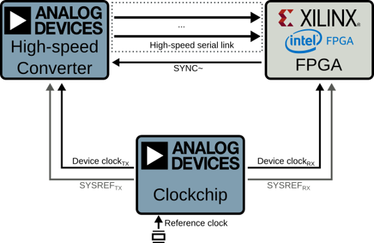

# pyadi-jif: Python interface for the ADI JESD Interface Framework

This project tries to simplify JESD204 configuration exploration and validation for ADI JESD based converters and clock chips with different FPGA vendors.

[](https://pypi.python.org/pypi/pyadi-jif/) [](https://github.com/analogdevicesinc/pyadi-jif/actions/workflows/tests.yml) [](https://codecov.io/gh/analogdevicesinc/pyadi-jif)

[](https://analogdevicesinc.github.io/pyadi-jif/) [](https://pypi.python.org/pypi/pyadi-jif/)

<p align="center">
  
</p>

```{toctree}
:maxdepth: 1
install.md
flow.md
converters.md
clocks.md
fpgas/index
parts.md
defs.md
devs/index
draw.md
developers.md
```