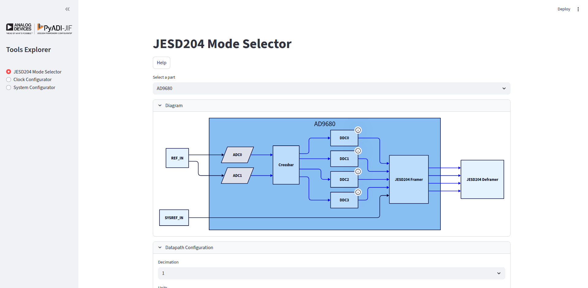
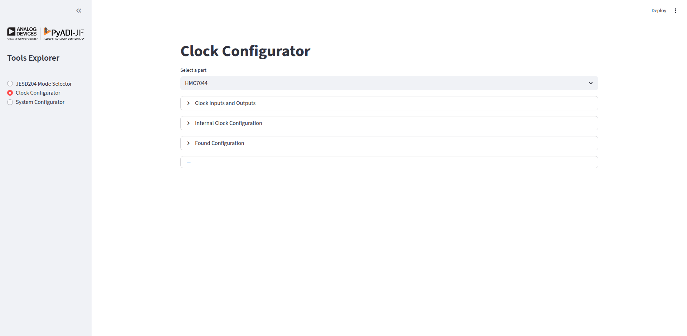
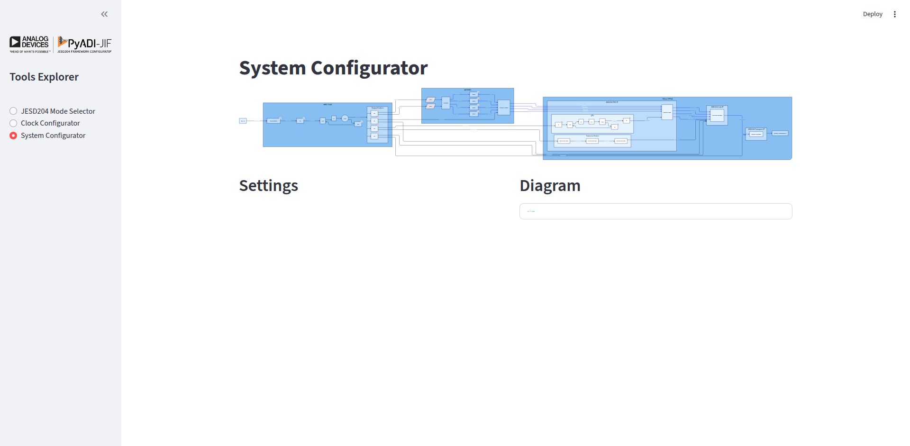

# JIF Tools Explorer

The JIF Tools Explorer is an interactive web-based application built with Streamlit that provides a graphical interface for configuring and exploring JESD204 based systems with Analog Devices converters and clock chips.

```{admonition} New to JIF Tools?
:class: tip
Check out the [Quick Start Guide](tools_quickstart.md) for step-by-step examples to get up and running in minutes!
```

## Installation

The JIF Tools Explorer is included with the pyadi-jif package. Install it with:

```bash
pip install 'pyadi-jif[cplex]'
```

For development or to include Streamlit dependencies:

```bash
pip install 'pyadi-jif[cplex,tools,draw]'
```

## Launching the Application

Once installed, you can launch the JIF Tools Explorer from the command line:

```bash
jiftools
```

This will start a local web server and automatically open the application in your default web browser. The application typically runs at `http://localhost:8501`.

## Application Overview

The JIF Tools Explorer provides three main tools accessible from the sidebar:

1. **JESD204 Mode Selector** - Explore and filter JESD204 modes for ADI converters
2. **Clock Configurator** - Configure clock distribution chips for your system
3. **System Configurator** - Complete end-to-end system configuration (FPGA + Converter + Clock)

---

## JESD204 Mode Selector

The JESD204 Mode Selector helps you find suitable JESD204 modes for your ADI converter based on your application requirements.

### Features

- **Part Selection**: Choose from a wide range of ADI converters (ADCs, DACs, MxFEs, Transceivers)
- **Datapath Configuration**: Configure decimation/interpolation settings
- **Sample Rate Control**: Set converter sample rates with flexible units (Hz, kHz, MHz, GHz)
- **Mode Filtering**: Filter JESD204 modes by parameters (M, L, N, Np, F, S, K, HD, CS)
- **Validation**: Automatically validates modes against device constraints
- **Visual Diagrams**: View clock tree diagrams for ADC converters
- **Export**: Export mode tables to CSV

### Usage

#### 1. Select a Converter

From the "Select a part" dropdown, choose your converter. The list includes:
- ADCs: AD9680, AD9625, etc.
- DACs: AD9144, AD9136, etc.
- MxFEs: AD9081, AD9082, etc.
- Transceivers: adrv9009, etc.

#### 2. Configure Datapath

In the "Datapath Configuration" section:

**For ADCs:**
- Set decimation values (CDDC, FDDC if available)
- Configure converter sample rate

**For DACs:**
- Set interpolation values (CDUC, FDUC if available)
- Configure converter sample rate

#### 3. Set Converter Rate

1. Select units (Hz, kHz, MHz, or GHz)
2. Enter the desired converter rate
3. The derived sample rate will be calculated automatically

#### 4. Filter JESD Modes

Use the multiselect controls in the "Configuration" section to filter modes by JESD204 parameters:

- **M**: Number of converters
- **L**: Number of lanes
- **N**: Converter resolution
- **Np**: Number of bits per sample
- **F**: Octets per frame
- **S**: Samples per converter per frame cycle
- **K**: Frames per multiframe
- **HD**: High density mode
- **CS**: Control bits per sample

#### 5. View Results

The "JESD204 Modes" section displays:
- Valid modes matching your criteria
- Lane rates and sample rates for each mode
- Toggle to show/hide invalid modes

### Example Workflow

```python
# Example: Configure AD9680 for 1 GSPS operation

1. Select part: "AD9680"
2. Set decimation: 1 (no decimation)
3. Set units: GHz
4. Set converter rate: 1.0 GHz
5. Filter by L=4 (4 lanes)
6. Review valid modes in the table
7. Note lane rates for FPGA configuration
```

---

## Clock Configurator

The Clock Configurator helps you configure ADI clock distribution chips (e.g., HMC7044, AD9545) to generate the required clocks for your system.

### Features

- **Multi-Clock Output**: Configure multiple output clocks with different frequencies
- **Reference Clock**: Set input reference clock frequency
- **Internal Configuration**: Control internal clock chip parameters (VCO, dividers, etc.)
- **Visual Diagrams**: View generated clock tree diagrams
- **Device Tree Export**: Export configuration as device tree fragments (for supported chips)

### Usage

#### 1. Select a Clock Chip

Choose from supported clock chips:
- HMC7044 - High-performance clock distribution
- AD9545 - Quad/Octal Clock Generator & Synchronizer
- And more...

#### 2. Configure Clocks

**Reference Clock:**
- Set the input reference clock frequency

**Output Clocks:**
1. Specify number of clock outputs needed
2. For each output:
   - Set the desired frequency
   - Assign a descriptive name (e.g., "ADC_CLK", "FPGA_REF")

#### 3. Internal Configuration

Adjust internal parameters if needed:
- VCO frequency ranges
- Divider values
- Distribution settings

The tool will automatically calculate valid configurations.

#### 4. View Results

If a valid configuration is found:
- Configuration parameters are displayed
- Clock tree diagram shows the signal flow
- Device tree fragment (if supported) for Linux driver integration

### Example Workflow

```python
# Example: HMC7044 configuration for AD9680 + FPGA

1. Select part: "hmc7044"
2. Set reference clock: 125 MHz
3. Configure outputs:
   - Output 1: 1000 MHz (name: "ADC_SAMPLE_CLK")
   - Output 2: 250 MHz (name: "FPGA_REF_CLK")
4. Review generated configuration
5. View clock tree diagram
6. Export device tree fragment
```

---

## System Configurator

The System Configurator provides end-to-end configuration of a complete JESD204 system including FPGA, converter, and clock chip.

### Features

- **Complete System**: Configure all components together
- **FPGA Integration**: Set up FPGA transceiver parameters (Xilinx, Intel)
- **Development Kit Presets**: Quick setup for common evaluation boards
- **Automatic Solving**: Automatically finds valid configurations across all components
- **System Diagram**: Visualize the complete system architecture

### Usage

#### 1. Select Components

Choose:
- **Converter**: Your ADI converter (ADC/DAC/MxFE)
- **Clock Chip**: Clock distribution chip
- **FPGA**: Target FPGA vendor (Xilinx, Intel)

#### 2. Configure Converter

Set converter parameters:
- Sample clock frequency
- Decimation/interpolation
- JESD204 mode

#### 3. Configure FPGA

Select FPGA settings:
- Development kit (optional)
- Transceiver type (QPLL/CPLL for Xilinx)
- Reference clock frequency

#### 4. Set VCXO/Reference

Specify the system reference clock (VCXO) frequency.

#### 5. Solve and View

Click solve to:
- Calculate complete system configuration
- Validate all constraints are met
- Generate system diagram
- Show configuration for all components

### Example Workflow

```python
# Example: AD9680 + HMC7044 + Xilinx ZCU102

1. Create system:
   - Converter: "AD9680"
   - Clock: "hmc7044"
   - FPGA: "xilinx"
   - VCXO: 125 MHz

2. Configure converter:
   - Sample rate: 1 GSPS
   - Decimation: 1
   - Mode: 0x88
   - K: 32

3. Configure FPGA:
   - Dev kit: "zcu102"
   - Force QPLL: Yes

4. Solve system

5. View results:
   - Clock configuration
   - Converter settings
   - FPGA transceiver config
   - JESD204 link parameters
   - System block diagram
```

---

## Tips and Best Practices

### Performance Optimization

1. **Start Simple**: Begin with basic configurations before adding complexity
2. **Use Filters**: Narrow down modes early to reduce computation
3. **Valid Modes Toggle**: Hide invalid modes to focus on viable options

### Common Workflows

#### Finding Compatible Modes

1. Set your sample rate requirement
2. Filter by available lane count
3. Review lane rates against FPGA capabilities
4. Select mode with margin for PVT variation

#### Clock System Design

1. Identify all required clocks (ADC, FPGA ref, SYSREF, etc.)
2. Start with reference clock you have available
3. Configure outputs in priority order
4. Verify clock quality (jitter, phase noise)

#### System Integration

1. Use System Configurator for initial feasibility
2. Switch to individual tools for fine-tuning
3. Validate with hardware using exported configurations

### Troubleshooting

**No valid modes found:**
- Relax filter constraints
- Check sample rate is within device limits
- Verify decimation/interpolation settings

**Clock configuration fails:**
- Check if output frequencies are achievable with selected reference
- Verify VCO frequency ranges
- Try different internal divider settings

**System solve fails:**
- Ensure all components are compatible
- Check FPGA transceiver supports required lane rates
- Verify reference clock is appropriate for FPGA

---

## API Access

While the JIF Tools Explorer provides a graphical interface, all functionality is also available through the pyadi-jif Python API for scripting and automation:

```python
import adijif

# Example: Programmatic JESD mode search
converter = adijif.AD9680()
converter.sample_clock = 1e9
converter.decimation = 1

# Get valid modes
modes = converter.quick_configuration_modes

# Or use the mode selector
from adijif.utils import get_jesd_mode_from_params
found_modes = get_jesd_mode_from_params(
    converter,
    L=4,
    M=2,
    jesd_class="jesd204b"
)
```

For more details on the Python API, see the [API Documentation](converters.md).

---

## Screenshots

### JESD204 Mode Selector
The mode selector interface showing filtered modes for AD9680:



*Mode table with sample rates, lane rates, and configuration parameters*

### Clock Configurator
HMC7044 configuration with multiple outputs:



*Clock tree diagram showing signal distribution*

### System Configurator
Complete system configuration view:



*End-to-end system block diagram*

---

## Technical Details

### Architecture

The JIF Tools Explorer is built using:
- **Streamlit**: Web application framework
- **pyadi-jif**: Core JESD204 configuration library
- **docplex**: Constraint solver (CPLEX)
- **D2**: Diagram generation

### State Management

The application uses Streamlit's session state to maintain:
- Part selections across tool switches
- Configuration values
- Generated diagrams (cached for performance)

### Performance Considerations

- Diagram generation is cached per part
- Mode searching is optimized with early filtering
- Solver constraints are pre-validated

---

## Contributing

To contribute to JIF Tools Explorer:

1. See [Developer Documentation](developers.md)
2. Test changes with: `streamlit run adijif/tools/explorer/main.py`
3. Add tests in `tests/tools/`
4. Update documentation as needed

## Support

For issues or questions:
- GitHub Issues: https://github.com/analogdevicesinc/pyadi-jif/issues
- Documentation: https://analogdevicesinc.github.io/pyadi-jif/
- ADI Support: https://ez.analog.com/

---

## See Also

- [Installation Guide](install.md)
- [Converter Documentation](converters.md)
- [Clock Documentation](clocks.md)
- [FPGA Integration](fpgas/index)
- [Drawing Utilities](draw.md)
