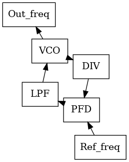

# Clock chips

Clock chip models are the central components of the **pyadi-jif** library and govern the majority of most configuration limitations. Since clock chips are responsible for providing all the necessary clocks for the different components they must understand all component clock requirements.

## Theory of operation

In traditional systems clock chips work as frequency generation systems with multiple PLLs. One PLL, typically called PLL1, is used for synchronization and jitter cleanup. The second PLL, typically called PLL2, is used for frequency generation from a VCXO or PLL1 and will be divided down to provide different output frequencies. The current clock chip models only model PLL2 with a VCXO source.

<!--  -->
<p align="center">
  
</p>


## Standalone usage

Clock chip models can be used standalone if the required clocks are known. This requires them to be directly provided. Below is an example of a configuration of a clock chip where the three desired output clocks and VCXO are supplied but the internal dividers need to be determined. The input divider **n2** is also constrained to 24 as well. Without applying this constraint, the solver could set **n2** to values between 12 and 255.


```python
# Create instance of AD9523-1 clocking model
clk = adijif.ad9523_1()
# Constrain feedback divider n2 to only 24
clk.n2 = 24
# Define clock sources and output clocks
vcxo = 125000000
output_clocks = [1e9, 500e6, 7.8125e6]
clock_names = ["ADC", "FPGA", "SYSREF"]
clk.set_requested_clocks(vcxo, output_clocks, clock_names)
# Call solver and collect configuration
clk.solve()
o = clk.get_config()
pprint.pprint(o)
```

**Sample Output**

```bash
{'m1': 3.0,
 'n2': 24,
 'out_dividers': [1.0, 2.0, 128.0],
 'output_clocks': {'ADC': {'divider': 1.0, 'rate': 1000000000.0},
                   'FPGA': {'divider': 2.0, 'rate': 500000000.0},
                   'SYSREF': {'divider': 128.0, 'rate': 7812500.0}},
 'r2': 1.0,
 'vcxo': 125000000.0}
```

When using clock chip models standalone the method **set_requested_clocks** must be called before **solve**. When using the **system** class this is automatically handled internally based on the components set at initialization.