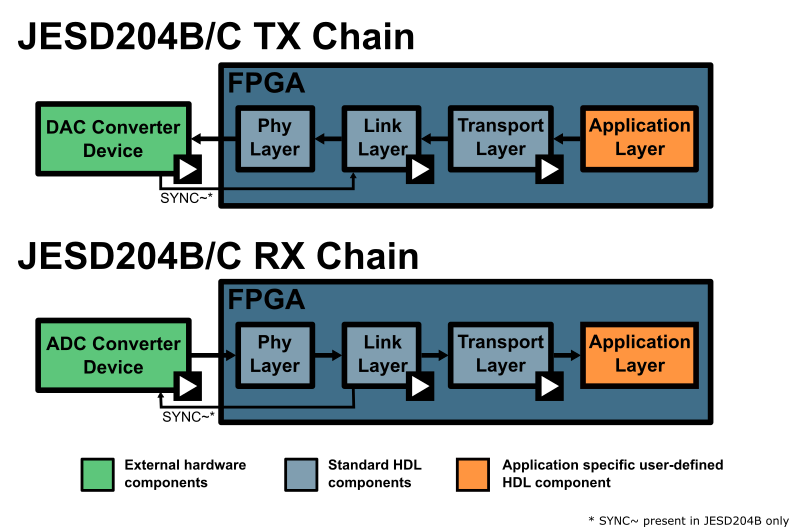

# FPGA Clocking

JESD204 is a protocol that is made up of layers to manage the different aspects of the data link between the converters and FPGA. On the converter side this is handled for you by the ASIC designer but the FPGA side requires a lot more work. This is heavily managed by the [ADI JESD204 Framework](https://wiki.analog.com/resources/fpga/peripherals/jesd204), but it still needs to be specifically configured and laid out correctly for a specific use case or set of use cases.



From the diagram above, we can see in the FPGA there are explicit cores within the FPGA to manager the PHY Layer, Link Layer, and Transport Layer aspects for the JESD204 protocol. These will have specific drivers and HDL IP that need to configured for a configuration. By configuration, it primarily refers to the clocking and JESD modes. In the diagram there are both TX and RX data paths but generically they can considered identical, data will just flow in a specific direction in each case.

## Clocking Layout

Focusing on an individual chain, we can consider the diagram below where the individual clocks are detailed. These clocks can be provided externally or internally but must meet some basic requirements. Traditionally they will come from an external clocking devices, which can drastically save power and resources, and **adijif** takes this approach.


The clocks will have the following constraints:

- **ref clock**: This clock's primary purpose is to drive the SERDES which will typically happen by feeding the CPLL or QPLL inside the transceiver primitives of the FPGA. Therefore, it's frequency is determined base on the PLL dividers and range limitations. The constraint here is that the **ref clock** times the PLL multiply/divide ratio must meet the lane rate of the desired link, which is fixed.
- **link clock**: This clock must be *lane rate /40* (204B) or *lane rate /66* (204C). It most cases the **ref clock** and the **link clock** will be the same value, or the **ref clock** is just selected to be equal to the **link clock** from the start for simplicity. However, this is not always possible. Therefore, the FPGA PLL clock dividers and muxes can be used to correctly meet this requirement from an upstream clock. These dividers and muxed are detailed in the diagram below, where *RXOUTCLK* is itself used to drive the link layer.
- **device clock**: This clock is unique since it must be derived from the same source as **SYSREF**, since it is used to sample **SYSREF** and be a multiple of the sample clock. The **device clock** determines the output rate of the link layer, and when this rate is different than the **link clock** it will enable the **Gearbox** inside the link layer HDL core. This will occur usually when *N'* is not 8 or 16, or when *F* != 1, 2, or 4. It is also important to select this clock with respect to desired data rate constraints for downstream logic since this is the rate application logic must consume data at. This clock will be at the *sample clock / N* where N is some integer. However, this rate should not exceed the Fmax of the FPGA logic.
- **SYSREF**: This clock is simple the system reference and will be *lane rate / M* where M is a power of 2 and should be large. 

Technically, only the **device clock** is needed by the FPGA and all other clocks (except for **SYSREF**) could be derived from it. This assumes the necessary ratios are possible by the internal dividers. However, in most cases **SYSREF** is used for deterministic latency.

<figure markdown>
  
  <figcaption><a href="https://docs.xilinx.com/v/u/en-US/ug576-ultrascale-gth-transceivers">From Xilinx UG576</a></figcaption>
</figure>

### Search Strategy

There are two main unique cases when selecting the **ref clock** and **device clock**:
* *N'* is not 8 or 16, or when *F* != 1, 2, or 4
* Otherwise

In case (1) the **ref clock** is unlikely to be derived from the **device clock**. Therefore, two separate clocks need to be provided to the FPGA. Otherwise, only a single clock (ignoring **SYSREF**) is required. This is the general behavior based on current analysis; however, this is not a hard definition. The internal solver is configured to favor **ref clock** and **device clock** to be the same value. When this is not possible it will automatically create a secondary clock from the clock chip to be specifically used a the **device clock**. The generation of a separate clock for device clock can be forced by setting *force_separate_device_clock* in the *fpga* object instantiated in the *system* object.

## API Controls

To manage the generation of these clocks, APIs are provided in the FPGA specific classes (*adijif.fpga.xilinx*). These are:

- **out_clk_select**: Control {RX/TX}CLKSEL mux. Options are *XCVR_REFCLK*, *XCVR_REFCLK_DIV2*, *XCVR_PROGDIV_CLK*
- **force_cpll**: Force use of CPLL
- **force_qpll**: Force use of QPLL
- **force_qpll1**: Force use of QPLL1 (only available on GTH and GTY transceivers)
- **force_separate_device_clock**: Enable generation of separate **device clock**. This rate is automatically determined base on Fmax of FPGA when enabled. When False the solver will automatically determine if a separate device clock is needed.

By default **adijif** will try to determine valid PLL settings and necessary muxing settings to meet the **link clock** and **ref clock** requirements. If a separate **device clock** is needed enable **requires_separate_link_layer_out_clock**.

Below is an example of an explicit request for a separate **device clock** and since **out_clk_select** is set to *XCVR_REFCLK* it will force the **ref clock** to be equal to the **link clock**.

```python

import adijif

vcxo = 125e6

sys = adijif.system("ad9680", "ad9523_1", "xilinx", vcxo)
sys.Debug_Solver = False

sys.fpga.setup_by_dev_kit_name("zcu102")
sys.fpga.force_cpll = True
sys.fpga.out_clk_select = "XCVR_REFCLK"  # force reference to be core clock rate
sys.fpga.requires_separate_link_layer_out_clock = True # Get extra clock

sys.converter.use_direct_clocking = True
sys.converter.set_quick_configuration_mode(0x88)
assert sys.converter.S == 1

# Limit upper dividers to powers of 2
sys.clock.d = [int(2 ** i) for i in range(8)]

# Current configuration
sys.converter.sample_clock = 1e9 / 2

cfg = sys.solve()
```

In the output the lines specific to the link layer and mux configuration have been highlighted:

```bash linenums="1" hl_lines="4 5 21 22 23 24"
{'clock': {'m1': 3,
           'n2': 24,
           'out_dividers': [2, 64, 8, 4],
           'output_clocks': {'AD9680_fpga_link_out_clk': {'divider': 4,
                                                          'rate': 250000000.0},
                             'ADC_CLK': {'divider': 2, 'rate': 500000000.0},
                             'ADC_CLK_FMC': {'divider': 8, 'rate': 125000000.0},
                             'ADC_SYSREF': {'divider': 64, 'rate': 15625000.0},
                             'CLKD_ADC_SYSREF': {'divider': 64,
                                                 'rate': 15625000.0}},
           'part': 'AD9523-1',
           'r2': 1,
           'vco': 1000000000.0,
           'vcxo': 125000000.0},
 'converter': [],
 'converter_AD9680': {'clocking_option': 'direct', 'decimation': 1},
 'fpga_AD9680': {'d': 1,
                 'm': 1,
                 'n1': 4,
                 'n2': 5,
                 'out_clk_select': 'XCVR_REF_CLK',
                 'sys_clk_select': 'XCVR_QPLL1',
                 'transport_samples_per_clock': 2,
                 'type': 'cpll',
                 'vco': 2500000000.0},
 'jesd_AD9680': {'CS': 0,
                 'F': 1,
                 'HD': 1,
                 'K': 32,
                 'L': 4,
                 'M': 2,
                 'Np': 16,
                 'S': 1,
                 'bit_clock': 5000000000.0,
                 'converter_clock': 500000000.0,
                 'jesd_class': 'jesd204b',
                 'jesd_mode': '136',
                 'multiframe_clock': 15625000.0,
                 'sample_clock': 500000000.0}}

```

### Per Part Configuration

By default individual FPGA properties will be applies to all signal chains. However, if a specific only wants to be applied to the ADC or DAC side, or ADC1 but not ADC2, this configuration is possible. This is done through dictionary parameterization as following:

```python linenums="1" hl_lines="6 7 8 9 11 12 13 14"
sys = adijif.system(["ad9680", "ad9144"], "ad9523_1", "xilinx", 125e6)

sys.fpga.setup_by_dev_kit_name("zcu102")
sys.fpga.force_cpll = True

sys.fpga.out_clk_select = {
    sys.converter[0]: "XCVR_REFCLK",
    sys.converter[1]: "XCVR_REFCLK_DIV2",
}

sys.fpga.requires_separate_link_layer_out_clock = {
    sys.converter[0]: True,
    sys.converter[1]: False,
}
...

```
